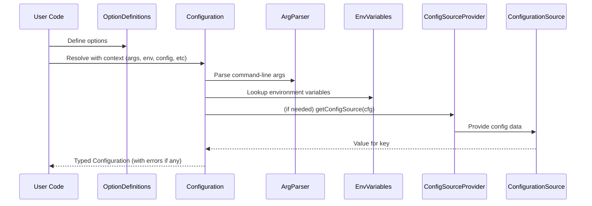

[](https://github.com/serverpod/serverpod)

# Config

The config package is a significant extension to the args package and enables
typed options, environment variables and configuration files as input, and
better error reporting.

## Overview

The config library is a significant extension to the Dart args package.

The main features are:

- Typed arg options: `int`, `DateTime`, `Duration`, user-defined `Enums`.
  - Automatic parsing and user-friendly error messages.
  - Type-specific constraints, such as min/max for all `Comparable` option types.
  - Multivalued options are typed, e.g. `List<MyEnum>`.
  - Custom types can easily be added and combined with the existing ones.
  - See [Supported option types](#supported-option-types) for the complete list.

- Equal support for positional arguments, with proper validation.
  - Arguments can be both positional and named, making the --name optional.

- Equal support for environment variables.
  - Options can be specified both via arguments and environment variables.
  - Environment variables have the same typed values support as args.

- Options can be fetched from [configuration files](#using-configuration-files) as well.
  - YAML/JSON configuration file support.

- Options can have custom value-providing callbacks.

- Named option groups are supported.
  - A group can specify mutually exclusive options.
  - A group can be mandatory in that at least one of its options is set.

- Tracability - the information on an option's value source is retained.

- The error handling is consistent, in contrast to the args package.
  - Fail-fast, all validation is performed up-front.
  - All errors are collected, avoiding the poor UX of fix-one-and-then-get-the-next-error.
  - Well-defined exception behavior.

These tools were developed for the Serverpod CLI but can be used in any Dart project.

## Drop-in replacement

The `ConfigParser` class is designed as a drop-in replacement for `ArgParser`
from the `args` package. Its purpose is to make it easy to transition
to the config library - just replace the name `ArgParser` with `ConfigParser`.

It maintains almost complete compatibility with the original package while
enabling direct use of the new features.

It achieves complete compatibility with the original package with the exception
of addCommand(), which you can replace with
[`BetterCommandRunner`](https://github.com/serverpod/cli_tools/blob/pkg-split/packages/cli_tools/lib/src/better_command_runner/better_command_runner.dart)
from the [`cli_tools package`](https://pub.dev/packages/cli_tools).

- **Compatibility**: The `ConfigParser` implements the same interface as
  `ArgParser`, and returns a `ConfigResults` object that implements `ArgResults`.
- **Usage**: You can directly replace `ArgParser` in your existing code:
  ```dart
  final parser = ConfigParser();  // instead of ArgParser()
  parser.addFlag('verbose', abbr: 'v');
  parser.addOption('port', defaultsTo: '8080');
  parser.addOption('host', envName: 'HOST');  // using env feature
  final results = parser.parse(['--verbose', '--port', '3000']);
  ```

- **Key Differences**:
  - The `addCommand()` method is not supported
  (see [`BetterCommandRunner`](https://github.com/serverpod/cli_tools/blob/pkg-split/packages/cli_tools/lib/src/better_command_runner/better_command_runner.dart) instead)
  - All validation is performed up-front with consistent error messages
  - The parser supports additional configuration sources (environment variables, config files)

- **Migration Path**: You can start using `ConfigParser` as a direct replacement
for `ArgParser` and gradually adopt its additional features as needed.

## Usage

_For transitioning existing code from ArgParser, see the drop-in replacement
section above._

This library emphasizes a declarative style of defining options.
Here is a real-life example, from a _show logs_ command,
that shows how to create a set of options for a particular command as an _enum_.

```dart
import 'package:config/config.dart';

enum LogOption<V> implements OptionDefinition<V> {
  limit(IntOption(
    argName: 'limit',
    helpText: 'The maximum number of log records to fetch.',
    defaultsTo: 50,
    min: 0,
  )),
  utc(FlagOption(
    argName: 'utc',
    argAbbrev: 'u',
    helpText: 'Display timestamps in UTC timezone instead of local.',
    defaultsTo: false,
    envName: 'DISPLAY_UTC',
  )),
  recent(DurationOption(
    argName: 'recent',
    argAbbrev: 'r',
    argPos: 0,
    helpText:
        'Fetch records from the recent period. '
        'Can also be specified as the first argument.',
    min: Duration.zero,
  )),
  before(DateTimeOption(
    argName: 'before',
    helpText: 'Fetch records from before this timestamp.',
  ));

  const LogOption(this.option);

  @override
  final ConfigOptionBase<V> option;
}
```

The enum form enables constant initialization, typed `Configuration<LogType>`,
and easy reference.

```dart
  Future<void> runWithConfig(
    final Configuration<LogOption> commandConfig,
  ) async {
    final limit = commandConfig.value(LogOption.limit);
    final inUtc = commandConfig.value(LogOption.utc);
    final recentOpt = commandConfig.optionalValue(LogOption.recent);
    final beforeOpt = commandConfig.optionalValue(LogOption.before);
    ...
  }
```

It is also possible to create them as a List:

```dart
abstract final class _ProjectOptions {
  static const name = StringOption(
    argName: 'name',
    mandatory: true
  );
  static const enable = FlagOption(
    argName: 'enable',
    defaultsTo: false,
  );

  static createOptions = <OptionDefinition>[
    name,
    enable,
  ];
}
...

  Future<void> runWithConfig(
    final Configuration commandConfig,
  ) async {
    final name = commandConfig.value(_ProjectOptions.name);
    final enable = commandConfig.value(_ProjectOptions.enable);
    ...
  }
```

> Note that options that are mandatory or have a default value have a guaranteed value.
They return a non-nullable type, while "optional" options return a nullable type.

### Main classes

An instance of the [OptionDefinition](lib/src/config/configuration.dart) class
defines an option.
This is an abstract class and implemented by option Enum types
as well as the base option class `ConfigOptionBase`. 
The latter is typically
not used directly, instead the typed subclasses are used such as `StringOption`
or `IntOption`.

An instance of the [Configuration](lib/src/config/configuration.dart) class
holds a configuration, i.e. the values for a set of option definitions.

### Resolution order

The configuration library resolves each option value in a specific order, with earlier sources taking precedence over later ones.

1. **Command-line arguments**
   - Named arguments (e.g., `--verbose` or `-v`) have top precedence
   - Positional arguments are resolved after named
   - Specified using `argName`, `argAbbrev`, and `argPos`

2. **Environment variables**
   - Environment variables have second precedence after CLI arguments
   - Variable name is specified using `envName`

3. **Configuration files**
   - Values from configuration files (e.g. YAML/JSON)
   - Lookup key is specified using `configKey`

4. **Custom value providers**
   - Values from custom callbacks
   - Callbacks are allowed to depend on other option values
     (option definition order is significant in this case)
   - Callback is specified using `fromCustom`

5. **Default values**
   - A default value guarantees that an option has a value
   - Const values are specified using `defaultsTo`
   - Non-const values are specifed with a callback using `fromDefault`

This order ensures that:
- Command-line arguments always take precedence, allowing users to override any other settings
- Environment variables can be used for values used across multiple command invocations,
  or to override other configuration sources
- Configuration files provide persistent settings
- Custom providers enable complex logic and integration with external systems
- Default values serve as a fallback when no other value is specified

### Resolution sources

Only the value sources provided to the `Configuration.resolve` constructor are
actually included. This means that any precedence tiers can be skipped,
regardless of what the option definitions say.

This enables flexible inclusion of sources depending on context
and helps constructing specific test cases.

### Supported option types

The library provides a rich set of typed options out of the box. All option types support the common arguments like `argName`, `helpText`, `mandatory`, etc. Below are the additional type-specific arguments:

| Value Type | Option Class | Additional Settings | Description |
|------|-------|---------------------|-------------|
| String | `StringOption` | None | String values |
| Boolean | `FlagOption` | `negatable` | Whether the flag can be negated |
| Integer | `IntOption` | `min`<br>`max` | Minimum allowed value<br>Maximum allowed value |
| DateTime | `DateTimeOption` | `min`<br>`max` | Minimum allowed date/time<br>Maximum allowed date/time |
| Duration | `DurationOption` | `min`<br>`max` | Minimum allowed duration<br>Maximum allowed duration |
| Any Enum | `EnumOption<E>` | None | Typed enum values |
| File | `FileOption` | `mode` | Whether the file must exist, must not exist, or may exist |
| Directory | `DirOption` | `mode` | Whether the directory must exist, must not exist, or may exist |
| String List | `MultiStringOption` | `splitCommas` | Whether to split input on commas |
| Any List | `MultiOption<T>` | `multiParser` | Parser for the element type |

It is easy to add custom option types, and to reuse the parsing code from existing option types. Just copy code from existing options and modify as needed.

#### Common option features

All option types support:
- Command-line arguments (full name, abbreviated name, and positional)
- Environment variables
- Configuration file values
- Custom value-providing callback
- Default values
- Allowed values list validation
- Aliases
- Custom validation
- Help text and value descriptions
- Mandatory
- Hidden
- Option groups

### Resolving a Configuration

This is an overview of how a Configuration is resolved.



## Integration with commands

In Dart, commands are often implemented using `Command` and `CommandRunner`
from the `args` package.

To use the config library with these, they need to be subclassed
to modify the use of `ArgParser` and introduce `Configuration`. This has
already been done for you, with the `BetterCommand` and `BetterCommandRunner`
classes in the `better_command_runner` library in the
[`cli_tools package`](https://pub.dev/packages/cli_tools).

See the full example [cli_tools/example/simple_command_example.dart](https://github.com/serverpod/cli_tools/blob/pkg-split/packages/cli_tools/example/simple_command_example.dart).

## Using configuration files

To use configuration files as a source of option values,
a `ConfigurationBroker` needs to be provided when resolving the
`Configuration`.

```dart
  Configuration.resolve(
    options: options,
    argResults: argResults,
    env: envVariables,
    configBroker: FileConfigBroker(),
  );
```

A file-reading ConfigurationBroker can be implemented like this:

```dart
class FileConfigBroker implements ConfigurationBroker {
  ConfigurationSource? _configSource;

  FileConfigBroker();

  @override
  String? valueOrNull(final String key, final Configuration cfg) {
    // By lazy-loading the config, the file path can depend on another option
    _configSource ??= ConfigurationParser.fromFile(
      cfg.value(TimeSeriesOption.configFile).path,
    );
    final value = _configSource?.valueOrNull(key);
    return value is String ? value : null;
  }
}
```

To reference a value from the configuration broker in an option definition,
specify the `configKey`. In this example, the configuration file is a JSON or
YAML file and the JSON pointer syntax is used.

```dart
  interval(DurationOption(
    argName: 'interval',
    argAbbrev: 'i',
    configKey: '/interval', // JSON pointer
  ));
```

See the full example in [example/config_file_example.dart](example/config_file_example.dart).

### Multiple configuration sources

By using the `MultiDomainConfigBroker`, configuration sources
from multiple providers can be used, called configuration *domains*.

They are distinguished by the format used in the configKey,
which needs to specify a so-called *qualified key* -
qualifying the key with the domain it is found in.

Domains are matched using `Pattern`, e.g. string prefixes or regular expressions.
For example, a simple prefix and colon syntax can be used:

```dart
  dir(DirOption(
    argName: 'dir',
    configKey: 'local:/dir',
    helpText: 'the local directory',
  )),
  host(StringOption(
    argName: 'host',
    configKey: 'remote:/host',
    helpText: 'the remote host name',
  ));
```

The first domain that matches the qualified key is used to retrieve the value.
This means that the order of the domains is significant if the matching patterns
overlap.

#### RegExp domains

Advanced pattern matching is supported via `RegExp`, enabling complex qualifiers
including paths and URLs, such that the key pattern qualifies the domain.

When using regular expressions to identify the domain, the value key is derived
from the qualified key depending on the capturing groups in the regex.

- If the regex has no capturing groups:
  - If the regex matches a shorter string than the qualified key, the value key is the remainder after the match.\
    This makes prefix matching simple.
  - If the regex matches the entire qualified key, the value key is the entire qualified key.\
    This can be used for specific syntaxes like URLs.

- If the regex has one or more capturing groups:\
  The value key is the string captured by the first group.

For more information, see the
[`MultiDomainConfigBroker`](lib/src/config/multi_config_source.dart)
source documentation.

## Contributing to the Project

We are happy to accept contributions. To contribute, please do the following:

1. Fork the repository
2. Create a feature branch
3. Commit your changes
4. Push to the branch
5. Create a pull request
6. Discuss and modify the pull request as necessary
7. The pull request will be accepted and merged by the repository owner

Tests are required to accept any pull requests.

See also [CONTRIBUTING](/CONTRIBUTING.md).
